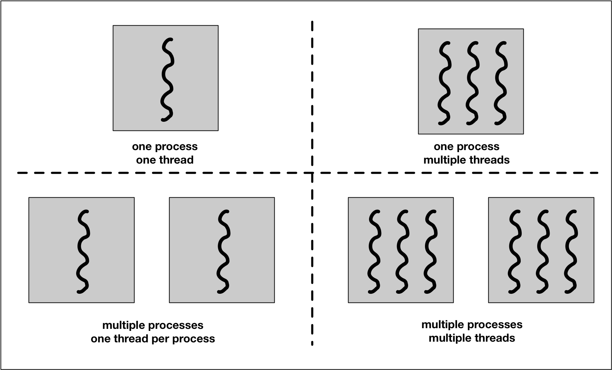
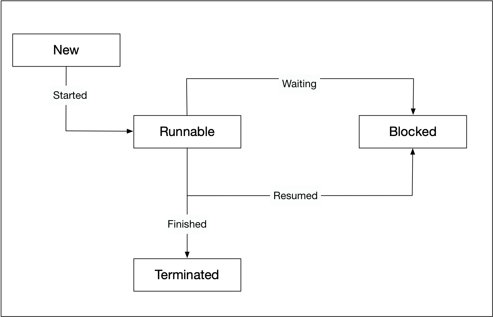

# CPP Concurrency

This repository are notes regarding cpp concurrency programming.

## Synchronous and Asynchronous

Asynchronous programs can continue with its line of execution without the need to wait for the parallel task to complete. The following figure illustrates this difference.


## Processes and Threads

A _process_ (also called a task) is a computer program at runtime. It is comprised of the runtime environment provided by the operating system (OS), as well as of the embedded binary code of the program during execution. A process is controlled by the OS through certain actions with which it sets the process into one of several carefully defined states:


- **Ready** : After its creation, a process enters the ready state and is loaded into main memory. The process now is ready to run and is waiting for CPU time to be executed. Processes that are ready for execution by the CPU are stored in a queue managed by the OS.
- **Running** : The operating system has selected the process for execution and the instructions within the process are executed on one or more of the available CPU cores.
- **Blocked** : A process that is blocked is one that is waiting for an event (such as a system resource becoming available) or the completion of an I/O operation.
- **Terminated** : When a process completes its execution or when it is being explicitly killed, it changes to the "terminated" state. The underlying program is no longer executing, but the process remains in the process table as a "zombie process". When it is finally removed from the process table, its lifetime ends.
- **Ready** suspended : A process that was initially in ready state but has been swapped out of main memory and placed onto external storage is said to be in suspend ready state. The process will transition back to ready state whenever it is moved to main memory again.
- **Blocked** suspended : A process that is blocked may also be swapped out of main memory. It may be swapped back in again under the same conditions as a "ready suspended" process. In such a case, the process will move to the blocked state, and may still be waiting for a resource to become available.

Processes are managed by the *scheduler* of the OS. The scheduler can either let a process run until it ends or blocks (non-interrupting scheduler), or it can ensure that the currently running process is interrupted after a short period of time. The scheduler can switch back and forth between different active processes (interrupting scheduler), alternately assigning them CPU time. The latter is the typical scheduling strategy of any modern operating system.

Since the administration of processes is computationally taxing, operating systems support a more resource-friendly way of realizing concurrent operations: the threads.

A *thread* represents a concurrent execution unit within a process. In contrast to full-blown processes as described above, threads are characterized as light-weight processes (LWP). These are significantly easier to create and destroy: In many systems the creation of a thread is up to 100 times faster than the creation of a process. This is especially advantageous in situations, when the need for concurrent operations changes dynamically.



Threads exist within processes and share their resources. As illustrated by the figure above, a process can contain several threads or - if no parallel processing is provided for in the program flow - only a single thread.

A major difference between a process and a thread is that each process has its own address space, while a thread does not require a new address space to be created. All the threads in a process can access its shared memory. Threads also share other OS dependent resources such as processors, files, and network connections. As a result, the management overhead for threads is typically less than for processes. Threads, however, are not protected against each other and must carefully synchronize when accessing the shared process resources to avoid conflicts.

Similar to processes, threads exist in different states, which are illustrated in the figure below:



- **New** : A thread is in this state once it has been created. Until it is actually running, it will not take any CPU resources.
- **Runnable** : In this state, a thread might actually be running or it might be ready to run at any instant of time. It is the responsibility of the thread scheduler to assign CPU time to the thread.
- **Blocked** : A thread might be in this state, when it is waiting for I/O operations to complete. When blocked, a thread cannot continue its execution any further until it is moved to the runnable state again. It will not consume any CPU time in this state. The thread scheduler is responsible for reactivating the thread.

## Lambda Function

- **Syntax**
```cpp
#include <iostream>

int main(int argc, char ** argv)
{
    int id = 5;
    void f1 = [&id] () mutable -> void { std::cout << "I have captured:" << id << std::endl};
    f1();
    return 0;
}
```
Symbol | Explanation
--- | ---
[] | Capturing variable
[id] | use the variable name to capture that variable by value
[=] | use = to capture all variables by value
[&id] | use & with variable name for capturing that variable by reference
[&] | use only & to capture all variables by reference
[&, id] | Capture all by reference, except id by value
[&id, id2] | capture id by reference and id2 by value

Symbol | Explanation
--- | ---
() | Accepting variable, just like a function

Symbol | Explanation
--- | ---
-> void | this is option, only needed if you want to specify the return type
mutable -> | lambda function generally do not change the value taken from [], however, you make set it as mutable so that the value capture by [] can be changed

## Passing Arguement to thread

- Function Collaborator (class)
- Lamda
- Variadic Template
- Member Function

## Initializing with class
```cpp
#include <iostream>
#include <threads>

class Vehicle
{
  private:
    int _id;
  public:
    Vehicle(int id)
    {
        _id = id;
    }
    void operator () ()
    {
      std::cout << "Vehicle object #" << _id << " has been created\n";
    }
};

int main(int argc, char ** argv)
{
  std::thread t1((Vehicle(1)));              // Add an extra pair of parantheses
  std::thread t2 = std::thread(Vehicle(2));  // Use copy initialization
  std::thread t3 {Vehicle(3)};               // Use uniform initialization with braces

  std::cout << "Finished work in main\n";

  if(t1.joinable())
    t1.join();
  if(t2.joinable())
    t2.join();
  if(t3.joinable())
    t3.join();

  return 0;
}
```

## CMakeLists.txt

Simple program:
```cpp
#include <iostream>
#include <thread>


void threadFunction()
{
    std::this_thread::sleep_for(std::chrono::milliseconds(100)); // Sleep as a simulation of workd
    std::cout << "Finished work in thread\n";
}

int main(int argc, char ** argv)
{
    // Create thread
    std::thread t(threadFunction);

    // Do something in this thread
    std::this_thread::sleep_for(std::chron::milliseconds(50));
    std::cout << "Finished work in main\n";

    // Wait for thread to finish, do check if it is joinable first
    if(t.joinable())
    {
        t.join();
    }

    return 0;
}
```

The CMakeLists.txt will be as follow:
```cmake
cmake_minimum_required(VERSION 3.17)

# Use the CMakeLists.txt's parent directory name as the project id and name
get_filename_component(PROJECT_ID ${CMAKE_CURRENT_SOURCE_DIR} NAME)
string(REPLACE " " "_" PROJECT_ID ${PROJECT_ID})
project(${PROJECT_ID})

find_package(Threads)

add_executable(test main.cpp)

target_link_libraries(test ${CMAKE_THREAD_LIBS_INIT})
```
